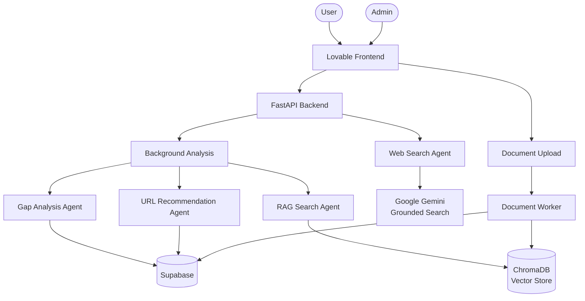
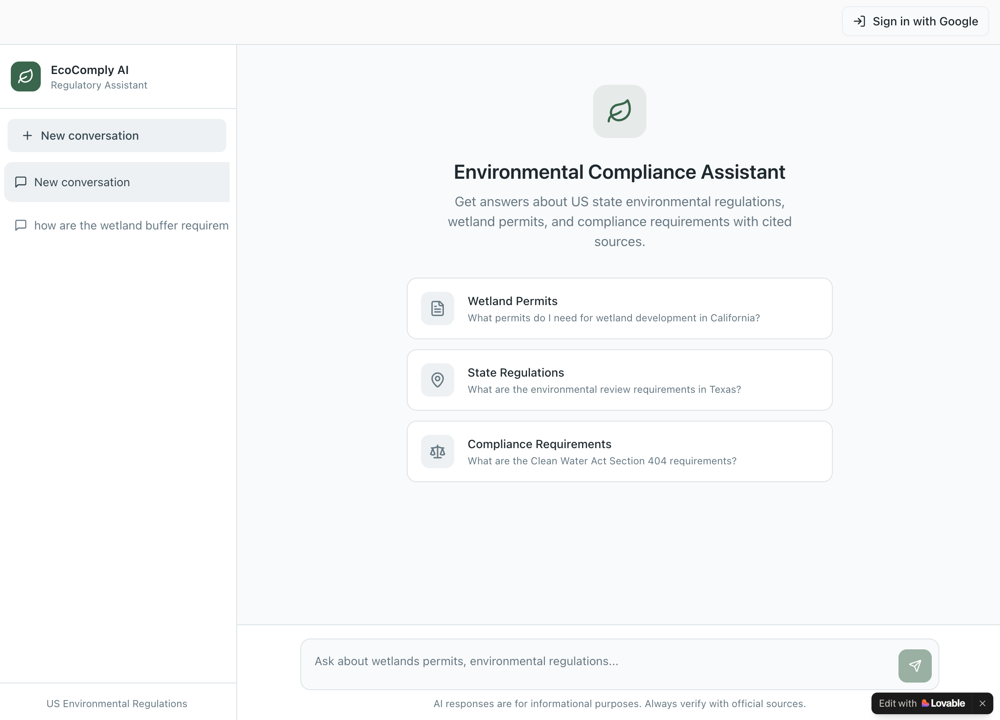
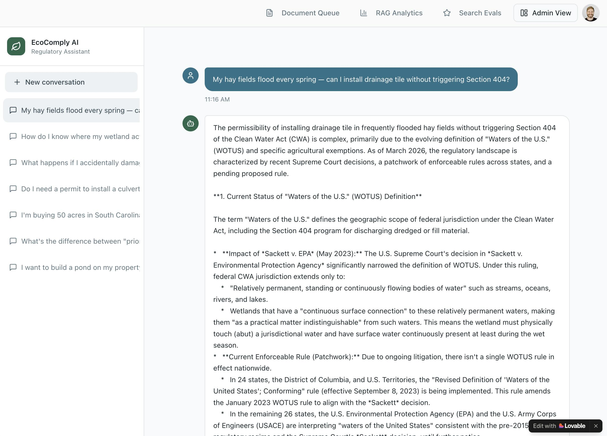
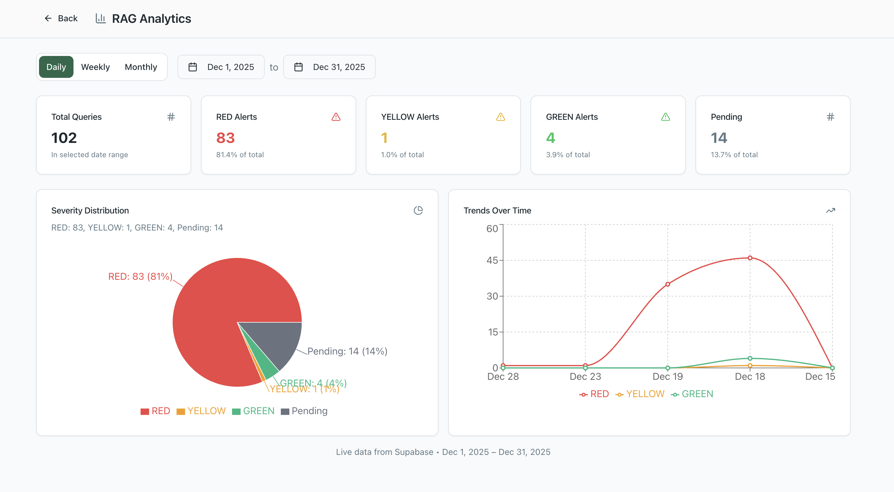
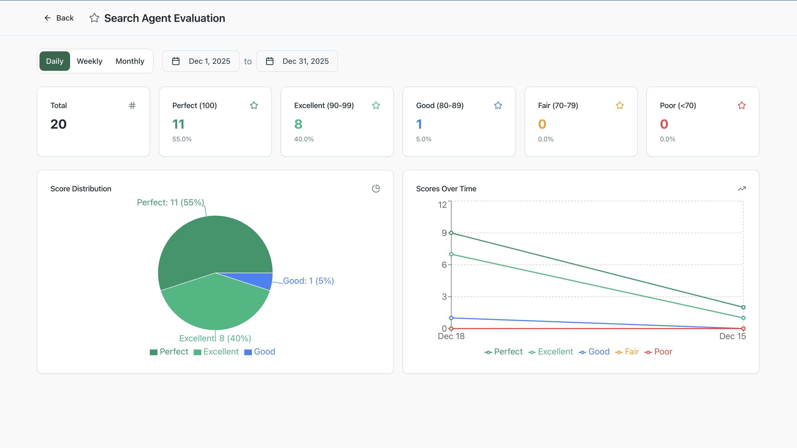
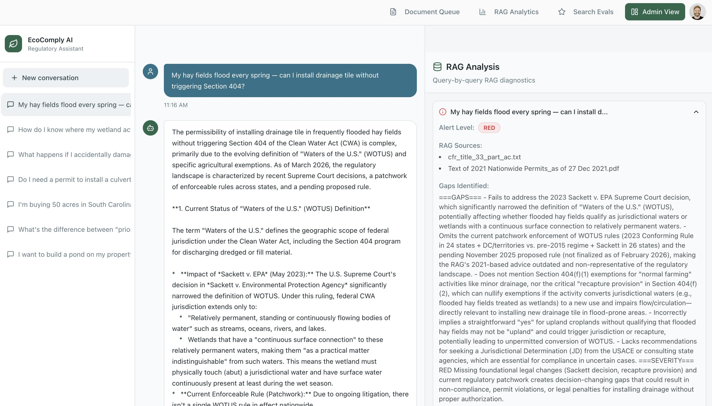
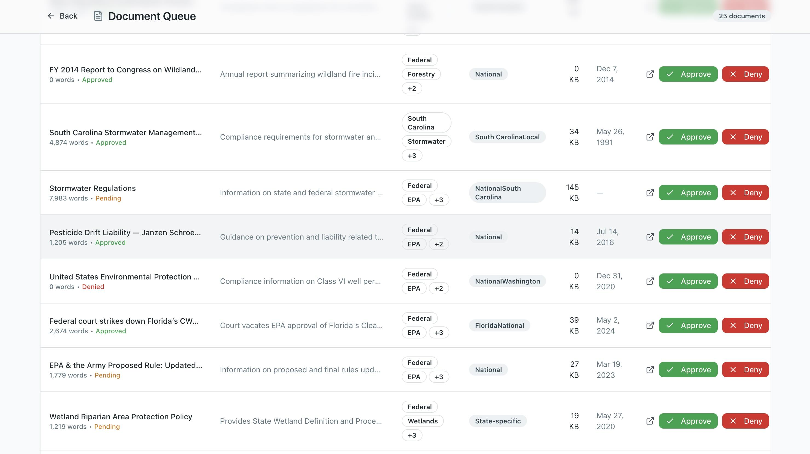

# EcoComply AI

[]()
[]()
[]()
[]()
[]()

> :warning: This repository contains project documentation only.
> Source code is maintained in a private repository.

An AI-powered environmental compliance assistant that combines RAG (Retrieval-Augmented Generation) with real-time web search to help landowners navigate federal and state environmental regulations.

## Architecture







## What It Does

EcoComply AI helps landowners maintain environmental compliance by searching an internal database of 67 federal and state regulatory documents alongside real-time web sources. A multi-agent system performs gap analysis between internal knowledge and current regulations, automatically flagging when the knowledge base needs updating. The admin dashboard surfaces these gaps with priority-ranked URL recommendations for database expansion.

## Tech Stack

- **FastAPI** — REST API backend with async background processing
- **ChromaDB** — Vector database for document embeddings and semantic search
- **LangChain** — RAG framework for document ingestion and query synthesis
- **OpenRouter** — LLM access (Claude 3.5 Sonnet)
- **Google Gemini 2.5 Flash** — Web search with grounding
- **OpenAI text-embedding-3-large** — Document embeddings (via OpenRouter)
- **Supabase** — Database, authentication, and document management
- **Lovable** — Frontend UI with user query interface and admin dashboard

## Usage Examples









**Sample query and response:**

```json
{
  "query": "What wetland permits do I need for construction near a stream in Georgia?",
  "user_id": "user-123",
  "session_id": "session-456"
}
```

```json
{
  "status": "success",
  "response": "For construction near streams in Georgia, you typically need: (1) A Section 404 permit from the U.S. Army Corps of Engineers under the Clean Water Act for any discharge of dredged or fill material into waters of the U.S., (2) A Section 401 Water Quality Certification from Georgia EPD...",
  "sources": [
    "33 CFR Part 323 - Permits for Discharges of Dredged or Fill Material",
    "Georgia Water Quality Standards (Aug 2022)",
    "1987 Corps Wetland Delineation Manual"
  ],
  "response_time_ms": 6200
}
```

**Multi-agent gap analysis (admin view):**

```json
{
  "alert_level": "YELLOW",
  "gap_summary": "RAG database covers federal CWA requirements but is missing Georgia's 2024 updated 303(d) list and recent EPD guidance on stream buffer variances.",
  "recommended_urls": [
    {
      "url": "https://epd.georgia.gov/watershed-protection-branch/water-quality-georgia",
      "priority": "high",
      "reason": "Georgia 2024 impaired waters list not in RAG database"
    }
  ]
}
```

## Video Walkthrough

[Watch the full demo on Loom](https://www.loom.com/share/214f29b6475d4a5cbf31975dd109f383)

## Results / Outcomes

- **76,914 document chunks** indexed from 67 federal and state regulatory documents
- **5–10 second response time** for user-facing web search queries
- **95% excellent-to-perfect** search agent evaluation scores (assessed by Google Gemini 3 Pro)
- **128 test runs** completed during development and validation
- **3-tier gap detection** (GREEN / YELLOW / RED) automatically identifies knowledge base gaps

## Roadmap / Future Improvements

- Add support for additional state regulatory databases (currently covers Georgia, Florida, South Carolina)
- Implement scheduled regulatory update monitoring with automated alerts
- Add document versioning to track regulatory changes over time
- Expand OCR capabilities for scanned historical documents
- Build batch query mode for compliance audits across multiple parcels
